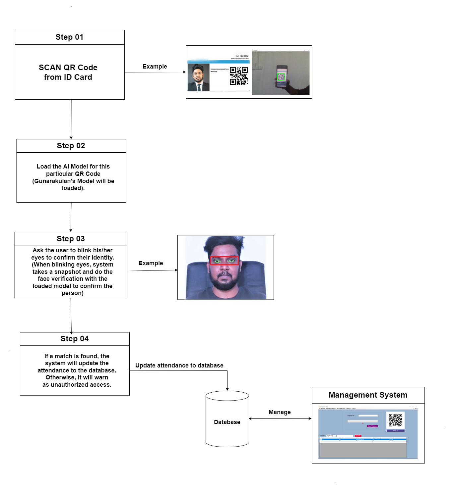
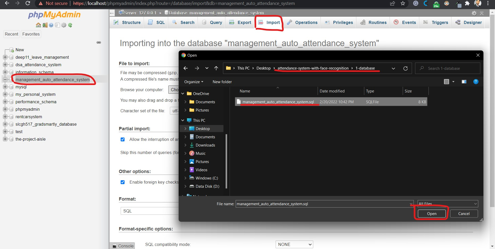
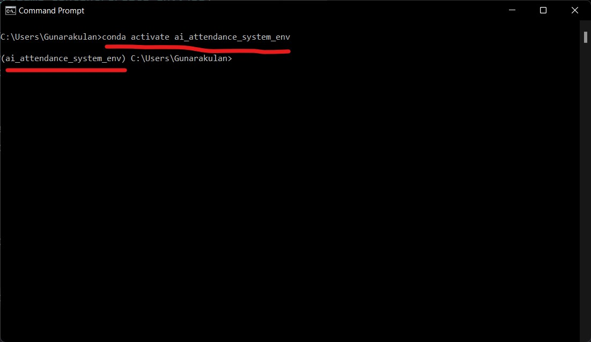

# Attendance System with Face Recognition

## Introduction

Attendance Management keeps track of your employee or students present/absent details. It is the system to document the time your employees/students work and the time they take off.

 In this digital era, face recognition system plays a vital role in  almost every  sector. Face recognition  is one  of the mostly used biometrics. It can used for security, authentication, identification.

This is an artificial intelligence based attendance management system with face recognition technology. The main objective of this AI based software solution is to update attendance with employees' face using computer vision.

This project can be divided into two main sub-systems. Attendance receiver module also called as face scanner (Written in Python) for reading and updating attendance to the database, and management module (Written in C#) for creating datasets of employees, training AI models with GUI, entering employees details and other management relented operations .





## Features

- Do not need to touch the device, the attendance can be done with face.
- Training can be done with a single click.
- It has a dataset creation module, where system can collect images of new employee.
- An easy approach management panel.
- Unauthorized access detection and prevention.
- Voice outputs
- Eye should be blinked to confirm the identify, this prevents digital image faking attack.


## Technologies & Frameworks  

#### Attendance Receiver - Face Scanner (Python)

- Python - Main programming language.
- OpenCV - for computer vision.
- Face_Recognition module
- Pyzbar module - for scanning QR code.
- PYTTSX3 - a module for voice outputs.
- Playsound - a module for playing external sounds.
- mysql module - for database management
- pickle module - store trained data as pickle file.

#### Management Panel (CSharp)
- C# - Main programming language
- MySQL - Database.


### Setup Management Panel (CSharp)

#### Step 01:
  - Create an empty database in MySQL panel with name of **"management_auto_attendance_system"**.


#### Step 02:

  - Import into that empty database with a SQL database that is found on following folder of this repository **(attendance-system-with-face-recognition/1-database)**.


  


### Setup Attendance Receiver - Face Scanner (Python)

The attendance receiver is the main script that takes attendances from employees and store in the database. This module handles OR code detection, face recognition processes.

Setting up this attendance receiver is a bit tricky one since it contains many dependencies and framework installation.

**Note:** We need to install all dependencies in a Python virtual environment in order to connect the management panel (C#) and attendances receiver (Python) properly. The virtual environment name must be **ai_attendance_system_env**. Because, the management panel (C#) listens for environment that has the name of **ai_attendance_system_env**.

### Create a Python virtual environment with the name of (ai_attendance_system_env)

In this step, a python virtual environment needs to be created in order to setup the attendance receiver (Face Scanner) module. There are many environment management tools available such as Venv, Anaconda, Virtualenv and etc. Here, we are going to use the Anaconda Python distribution tool to manage environments and packages installation. Because, Anaconda usually use for advanced data science purpose.

#### Step 01:

  - Install Anaconda Python distribution.

  

Anaconda is a distribution of the Python and R programming languages for scientific computing (data science, machine learning applications, large-scale data processing, predictive analytics, etc.), that aims to simplify package management and deployment.

In order to install the Anaconda distribution, please checkout the official website for the instructions (https://www.anaconda.com/).

Download Anaconda: https://www.anaconda.com/products/individual

Anaconda installation tutorial: https://www.youtube.com/watch?v=RYSNnp5V7ps&t

Anaconda Documentation: https://docs.anaconda.com/

#### Step 02:

 - Create a virtual environment using Anaconda.

At its core, the main purpose of Python virtual environments is to create an isolated environment for Python projects. This means that each project can have its own dependencies, regardless of what dependencies every other project has.

  

 - Enter the bellow command in Terminal/CMD after the successful installation of Anaconda.

 ```cmd
 conda create -n ai_attendance_system_env python=3.6
```

  

At this point, we are creating a virtual environment with the name of "ai_attendance_system_env" and this environment is using python 3.6.

**Note:** The environment name must be "ai_attendance_system_env".


#### Step 03:
  - Activate the "ai_attendance_system_env" environment.

  ```cmd
    conda activate ai_attendance_system_env
  ```
  


**Note:** After the activation, If we install a dependency, it will be installed under this environment.

#### Step 04:

- Install the following dependencies on the "ai_attendance_system_env" environment.


```cmd
  pip install opencv-python
```

```cmd
  pip install pyttsx3
```

```cmd
  pip install cmake
```

```cmd
  pip install face_recognition
```

```cmd
  pip install imutils
```

```cmd
  pip install playsound
```

```cmd
  pip install mysql-connector-python
```


```cmd
  pip install qrcode
```

**Note:** These are the important dependencies of the attendance receiver (Python) module. These dependencies must be installed  under the "ai_attendance_system_env" environment.
